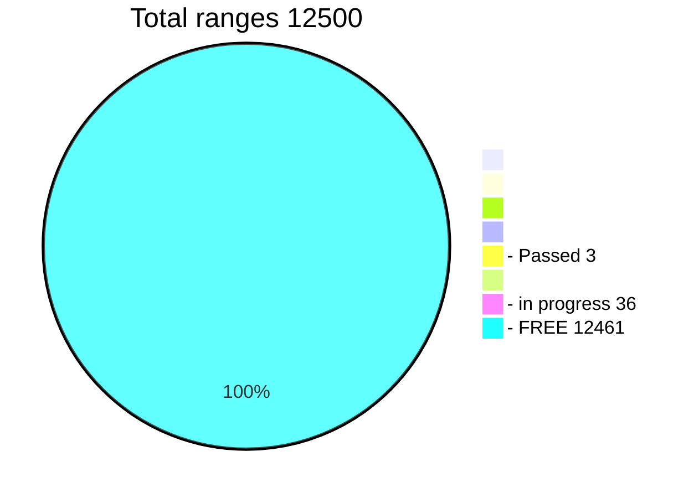

### Passphrases - Ranges (1-10,000)
All possible combinations length Length 8,9, (10-top 1000 ranges) symbols 

Priority Ranges 1-100

**Choose a free range:** 

- Ranges [1-999](https://github.com/phrutis/Passphrases/blob/main/Others/1-999.md)
- Ranges [1000-1999](https://github.com/phrutis/Passphrases/blob/main/Others/1000-1999.md)
- Ranges [2000-2999](https://github.com/phrutis/Passphrases/blob/main/Others/2000-2999.md)
- Ranges [3000-3999](https://github.com/phrutis/Passphrases/blob/main/Others/3000-3999.md)
- Ranges [4000-4999](https://github.com/phrutis/Passphrases/blob/main/Others/4000-4999.md)
- Ranges [5000-5999](https://github.com/phrutis/Passphrases/blob/main/Others/5000-5999.md)
- Ranges [6000-6999](https://github.com/phrutis/Passphrases/blob/main/Others/6000-6999.md)
- Ranges [7000-7999](https://github.com/phrutis/Passphrases/blob/main/Others/7000-7999.md)
- Ranges [8000-8999](https://github.com/phrutis/Passphrases/blob/main/Others/8000-8999.md)
- Ranges [9000-9999](https://github.com/phrutis/Passphrases/blob/main/Others/9000-9999.md)

### Words - Ranges (10,001-12,500) 

Create words from small letters and space (Length 10-13) and form sentences from words 

**Choose a free range:** 
- Ranges [10001-10999](https://github.com/phrutis/Passphrases/blob/main/Others/10001-10999.md)
- Ranges [11000-11999](https://github.com/phrutis/Passphrases/blob/main/Others/11000-11999.md)
- Ranges [12000-12500](https://github.com/phrutis/Passphrases/blob/main/Others/12000-12500.md)

### Table of found addresses

|     | Range | Balance | Adress         | Date       |
|-----|:------|--------|----------------|------------|
| 1   | 000   | $4.14  | [19ztuyJ9gPqbXR6DSCwVdouuf9nDhoChY3](https://www.blockchain.com/btc/address/19ztuyJ9gPqbXR6DSCwVdouuf9nDhoChY3) | 10.07.2022 |
| 2   | 000   | $4.14  | [1LMKEDdAheyCPw51qJofb7U9D7UmwtxNWn](https://www.blockchain.com/btc/address/1LMKEDdAheyCPw51qJofb7U9D7UmwtxNWn) | 10.07.2022 |
| 2   | 000   | $4.18  | [18wyfayzozH9Sm7SQHDUckbXLdxekYm4Qj](https://www.blockchain.com/btc/address/18wyfayzozH9Sm7SQHDUckbXLdxekYm4Qj) | 10.07.2022 |
| 4   | 000   | $  |  | 00.00.2022 |
| 5   | 000   | $  |  | 00.00.2022 |
| 6   | 000   | $  |  | 00.00.2022 |
| 7   | 000   | $  |  | 00.00.2022 |
| 8   | 000   | $  |  | 00.00.2022 |
| 9   | 000   | $  |  | 00.00.2022 |
| 10  | 000   | $  |  | 00.00.2022 |
| 11  | 000   | $  |  | 00.00.2022 |
| 12  | 000   | $  |  | 00.00.2022 |
| 13  | 000   | $  |  | 00.00.2022 |
| 14  | 000   | $  |  | 00.00.2022 |
| 15  | 000   | $  |  | 00.00.2022 |
| 16  | 000   | $  |  | 00.00.2022 |
| 17  | 000   | $  |  | 00.00.2022 |
| 18  | 000   | $  |  | 00.00.2022 |
| 19  | 000   | $  |  | 00.00.2022 |
| 20  | 000   | $  |  | 00.00.2022 |
| 21  | 000   | $  |  | 00.00.2022 |
| 22  | 000   | $  |  | 00.00.2022 |
| 23  | 000   | $  |  | 00.00.2022 |
| 24  | 000   | $  |  | 00.00.2022 |
| 25  | 000   | $  |  | 00.00.2022 |
| 26  | 000   | $  |  | 00.00.2022 |
| 27  | 000   | $  |  | 00.00.2022 |
| 28  | 000   | $  |  | 00.00.2022 |
| 29  | 000   | $  |  | 00.00.2022 |
| 30  | 000   | $  |  | 00.00.2022 |
| 31  | 000   | $  |  | 00.00.2022 |
| 32  | 000   | $  |  | 00.00.2022 |
| 33  | 000   | $  |  | 00.00.2022 |
| 34  | 000   | $  |  | 00.00.2022 |
| 35  | 000   | $  |  | 00.00.2022 |
| 36  | 000   | $  |  | 00.00.2022 |
| 37  | 000   | $  |  | 00.00.2022 |
| 38  | 000   | $  |  | 00.00.2022 |
| 39  | 000   | $  |  | 00.00.2022 |
| 40  | 000   | $  |  | 00.00.2022 |
| 41  | 000   | $  |  | 00.00.2022 |
| 42  | 000   | $  |  | 00.00.2022 |
| 43  | 000   | $  |  | 00.00.2022 |
| 44  | 000   | $  |  | 00.00.2022 |
| 45  | 000   | $  |  | 00.00.2022 |
| 46  | 000   | $  |  | 00.00.2022 |
| 47  | 000   | $  |  | 00.00.2022 |
| 48  | 000   | $  |  | 00.00.2022 |
| 49  | 000   | $  |  | 00.00.2022 |
| 50  | 000   | $  |  | 00.00.2022 |

