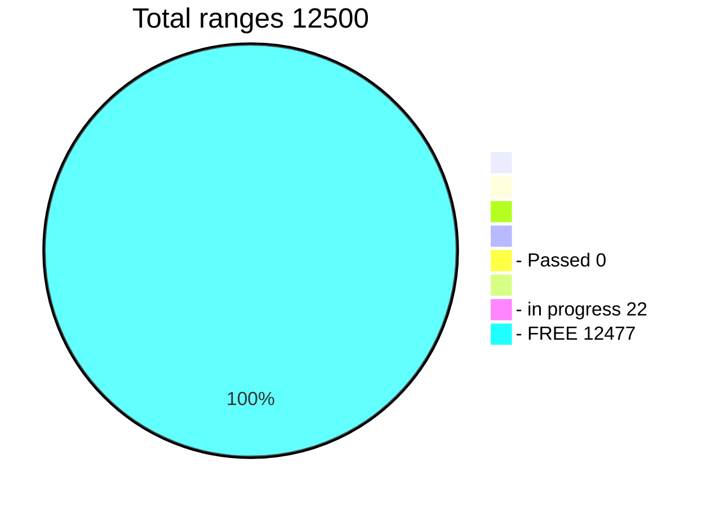

## Find Lost Bitcoin Passphrases


**Find your lost passphrase get 50% of the find**</br>
Search passphrases on the fastest program in the world</br>
[18,972](https://allprivatekeys.com/hacked-brainwallets-with-balance) passphrases were found, an estimated 5,000 passphrases are lost</br>
They were found on a processor with a maximum speed of 100,000 characters per second.</br>
Challenge Speed 3090 = 180,000,000/sec. It's 1800 times faster.</br>
The fact that one 3090 GPU runs in 24 hours is a [legendary CPU program](https://github.com/ryancdotorg/brainflayer) in 5 years.</br>

How to search for old lost passphrases:</br>
If you have a GPU and are ready to search for a key **24/7**</br>

If you do not have a GPU card, you can [**rent**](https://vast.ai) it and participate in a collective search. </br>
For some users, [**renting**](https://vast.ai) is cheaper than searching on their own PC. There is also less noise in the house.</br>
When renting, you must take into account the risk that the key may not be found at all.</br> 
You may incur losses. Think of it not as earnings, but as a lottery.

In the [**TABLE**](https://github.com/phrutis/Passphrases/blob/main/Others/Table.md), select a **FREE** range between 1-12500

**Write in telrgram phrutis start 1234** (the range you took)</br>
I will add your range to [table](https://github.com/phrutis/Passphrases/blob/main/Others/Table.md) in progress</br>
This is to keep your range from being picked up by other hunters.</br>
This will save you from re-passing and confusion. This will speed up the search.</br>

Windows:</br>
Run ```Passphrases-30xx.exe --bits 25 -range 777 -inputAddress addresses.txt -d 0``` (free range 1 - 10000)</br>
Run ```Words.exe --bits 25 -range 10001 -inputAddress addresses.txt -d 0``` (free range 10001 - 12500)

Linux:</br>
Run: ```root@C.4115552:~$ chmod +x Passphrases-30xx```</br>
Run: ```root@C.4115552:~$ ./Passphrases-30xx --bits 25 -range 7777 -inputAddress addresses.txt -d 0``` (free range 1 - 10000)</br>

Run: ```root@C.4115552:~$ chmod +x Words```</br>
Run: ```root@C.4115552:~$ ./Words --bits 25 -range 10001 -inputAddress addresses.txt -d 0``` (free range 10001 - 12500)</br>

-d ? (GPU card number, id)</br>

| GPU card   | --bits      | Speed       | Time          |
|------------|:------------|-------------|---------------|
| A100       | 26          | 200 Mkeys   | 3 days        |
| A6000      | 25          | 180 Mkeys   | 4 days        |
| 3090       | 25          | 180 Mkeys   | 4 days        |
| 3080 Ti    | 24          | 160 Mkeys   | 5 days        |
| 3080       | 24          | 150 Mkeys   | 5 days        |
| 3070 Ti    | 24          | 120 Mkeys   | 6 days        |
| 3070       | 24          | 90 Mkeys    | 8 days        |
| 3060       | 24          | 70 Mkeys    | 10 days       |
| 3050       | 24          | 45 Mkeys    | 17 days       |
| 2080 Ti    | 24          |  ? Mkeys    | ?? days       |
| 2080       | 24          |  ? Mkeys    | ?? days       |
| 2070       | 24          |  ? Mkeys    | ?? days       |
| 1080       | 23          |  ? Mkeys    | ?? days       |
| 1070       | 23          |  ? Mkeys    | ?? days       |


For general questions, you can join a [**GPU group**](https://t.me/+WFEuFatijpowMjRi) of hunters.</br>
**Do not write in the group the numbers you are looking for, do not report the finds.**

## Frequently asked Questions
### Question answer:

I have many GPUs. How to start?</br>
Run each GPU separately with a new range Add your card id -d ?</br>

```Passphrases-30xx.exe --bits 25 -range 777 -inputAddress addresses.txt -d 0```</br>
```Passphrases-30xx.exe --bits 25 -range 833 -inputAddress addresses.txt -d 1```</br>
```Passphrases-30xx.exe --bits 25 -range 5555 -inputAddress addresses.txt -d 2```</br>
```Passphrases-30xx.exe --bits 25 -range 6767 -inputAddress addresses.txt -d 3```</br>
```Passphrases-30xx.exe --bits 25 -range 8888 -inputAddress addresses.txt -d 4```</br>
If you have any difficulties with the launch, you can ask in telegram [**GPU group**](https://t.me/+WFEuFatijpowMjRi)<hr>

Where can I get a base of addresses to start?</br>
You can download the database of addresses [**HERE**](https://github.com/phrutis/Passphrases/releases/tag/1.0)<hr>

Why did the program freeze at startup?</br>
She didn't hang up! Program start --bits25 (25-30 min.)</br>
The program creates tables and downloads to the device</br>
One card requires 4GB or more of RAM to work.</br>
The consumption depends on the size of the table (-bits) and the size of the address file.<hr>

What address formats can be uploaded?</br>
All bc.., 3.., 1.., in a text file from a new line</br>
It is recommended to use only OLD addresses 1... from 2$ ($10)<hr>

How to continue searching after stopping the program?</br>
For Windows run bat file Countinue.bat</br>
For Linux, open a Continue.txt, copy the line and run</br>
The program will continue searching from the last checkpoint<hr>

Explain what we are looking for?</br>
How it works? What's this?</br>
[Here is a good example](https://allprivatekeys.com/try-your-passphrase) of work for you.</br>
Enter passphrase: fhqyqzhao123 pay attention to the address 1MVFUmYLKmLyC1m3WfyHkEJTZfoHjwDeXE</br>
The difference is that instead of requests to the blockchain.</br> 
The program checks against the database of addresses with a positive balance.<hr>

I found. What to do?</br>
When you find the passphrase, a message will appear in the window.</br>
===== FOUND =====</br>
Address: 1......</br>
Privkey: XXX....</br>
=================</br>
The address and key will also be written to the text file FOUND.txt</br>
Do not tell anyone the found key!</br>
Write me a private message in telegram phrutis<hr>

What are we looking for?</br>
```Passphrases.exe``` - all possible combinations.</br>
Length 7,8,9,10 characters</br>
Example: pass7a0**Z, SaTellitE, %#j)xQ78~"</br>
```Words.exe``` - Create words from letters (Length 11-13) and form sentences from words</br>
Example: good bitcoin, substance btc, real password, ho ho ho ho<hr>

What is HEX id?</br>
When you pass the range by 100%, the program will end the search.</br>
It will be written in the window.</br>
Range 1234 - Passed</br>
HEX id XXX......</br>
A text file PASSED-HASHES.txt is also created
Send in telegram phrutis</br>
Range number and HEX id.</br>
I will mark in the table that the range has been passed.</br>
This is done so that hunters do not take already passed ranges and do not pass the same thing.</br>
Feel free to send me a HEX id - it will speed up the search and save time and costs.<hr>

Why does the program use a lot of RAM?</br>
The program creates the necessary tables and stores them in memory.<hr>

Does the program require an internet connection?</br>
No, the program is looking for the key offline.<hr>

Is your program working?</br>
I did not find anything, the problem is in the program.</br>
The program works correctly, it has been tested many times.</br>
If you have any doubts, you can go and find the found address from the find table<hr>

Why is the program without source codes?</br>
The program includes a range, decoders and more.</br>
Knowing them, there is no point in the challenge.<hr>

If I find the key can I take all the coins for myself?</br>
No, you will find BTC address and the encrypted key.</br>
Only the organizers of the challenge can decrypt this key and pay you a 50% from balance<hr>

Can you sell me the full version of the program?</br>
No, the program is not for sale.</br>
It doesn't make sense to sell the goose that lays the golden eggs.<hr>

What guarantees are there that you will pay me 50% when I find the private key?</br>
If you have found several addresses, start small and build up.</br>
There are no guarantees anywhere, the challenge is designed for trust.<hr>

I have a RTX 3060 TI card, and I have a low speed, how can speed up?</br>
In the new drivers for 30xx Ti, a limiter is installed that slows down the speed by half.</br>
You need to download the old driver from six months ago. 496.13</br>
Delete the new driver, install the old driver, the speed will increase x2</br>
After searching, you can install new drivers.<hr>

What is a range?</br>
This is a small part of the given symbols for passing a certain segment.</br>
All possible characters are applied (including special characters)</br>
Example range 7777</br>
Start characters: 
aabbccddd -> aabbccdde -> aabbc(0d8 -> aabH$&@#*</br>
Finish: aacZZZZZZZ<hr>

Is this theft?</br>
If the found address is 5-10 years old without movement, it is a lost coin.<hr>

What are the best ranges to look for?</br>
Where are the chances?</br>
I think 1-100, but you just need to hope for luck<hr>

I have other questions.</br>
Write questions in a telegram [**GPU group**](https://t.me/+WFEuFatijpowMjRi)<hr>

### A little explanation about the program in two modes.</br>
The first mode is clear.</br>
The letters are converted to sha256 at the output, we get a private key.</br>
An address is made from a private key, reconciliation against a database of addresses.</br>

The second mode is hepatic.</br>
Each private key is unique (valid)</br>
If we discard the first mode, we have a 100% valid random number of private keys at a speed of 180.000.000/sec</br>
What according to my hypothesis ([ru](https://github.com/phrutis/Rotor/issues/3)) gives more speed.</br>

The bottom line is that there are many ranges, this is a long distance.</br>
There is a high probability of finding a collision.</br>
Thus, you can find an address from the address database that was not originally created from a passphrase.</br>
Perhaps it was generated randomly, it's just that its private key matches the passphrase.</br>
If you find an address with recent transactions, I advise you not to touch it. It's someone's savings.</br>
#### We are looking for old coins (no movement), lost ones!</br>
