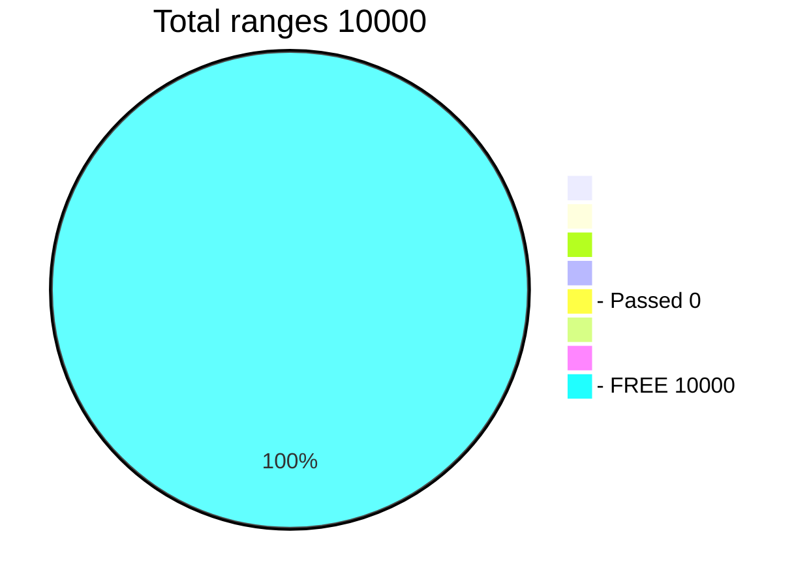

# Challenge - In the process of updating!
## Find Lost Bitcoin Passphrases


**Find your lost passphrase get 50% of the find**</br>
The search takes place on the fastest program</br>
[18972](https://allprivatekeys.com/hacked-brainwallets-with-balance) passphrases were found, an estimated 5,000 passphrases are lost</br>
They were found on a processor with a maximum speed of 100,000 characters per second.</br>
Challenge Speed 3090 = 180,000,000/sec. It's 1800 times faster.</br>
The fact that one 3090 GPU runs in 24 hours is a legendary CPU program in 5 years.</br>

How to search for old lost passphrases:</br>
If you have a GPUs:</br>
**RTX 2070, 2080, 2090, 3060, 3070, 3080, 3090, A5000, A6000** and are ready to search for a key **24/7**</br>

If you do not have a 30xx card, you can [**rent**](https://vast.ai) it and participate in a collective search. </br>
For some users, [**renting**](https://vast.ai) is cheaper than searching on their own PC. There is also less noise in the house.</br>
When renting, you must take into account the risk that the key may not be found at all.</br> 
You may incur losses. Think of it not as earnings, but as a lottery.

In the [**TABLE**](https://github.com/phrutis/Passphrases/blob/main/Others/table.md), select a **FREE** range between 1-10000

Windows:</br>
Run ```Passphrases-30xx.exe --bits 25 -range 777 -inputAddress addresses.txt -d 0``` (free range 1 - 10000)

Linux:</br>
Run: ```root@C.4115552:~$ chmod +x Passphrases_86```</br>
Run: ```root@C.4115552:~$ ./Passphrases_86 --bits 25 -range 7777 -inputAddress addresses.txt -d 0```</br>

For GPU 20xx use --bits 18 (24)</br>
-d ? (GPU card number)</br>

RTX A6000 180 Mkey/s = 4 days (one range)</br>
RTX 3090 180 Mkey/s = 4 days (one range)</br>
RTX 3070 120 Mkey/s = 8 days (one range)</br>
RTX 2070 30 Mkey/s = 20 days (one range)</br>

## Frequently asked Questions
### Question answer:

I have many GPUs. How to start?</br>
Run each GPU separately with a new range Add your card id -d ?</br>
For RTX 2070, 2080, 2090, 3060, 3070, 3080, 3090, A5000, A6000</br>
```Passphrases-30xx.exe --bits 25 -range 777 -inputAddress addresses.txt -d 0```</br>
```Passphrases-30xx.exe --bits 25 -range 833 -inputAddress addresses.txt -d 1```</br>
```Passphrases-30xx.exe --bits 25 -range 5555 -inputAddress addresses.txt -d 2```</br>
```Passphrases-30xx.exe --bits 25 -range 6767 -inputAddress addresses.txt -d 3```</br>
```Passphrases-30xx.exe --bits 25 -range 8888 -inputAddress addresses.txt -d 4```</br>
If you have any difficulties with the launch, you can ask in the group<hr>

Where can I get a base of addresses to start?</br>
in telegram group<hr>

I found. What to do?</br>
To be safe, do not share the key with anyone.</br>
Write about the find in a personal message in telegram phrutis<hr>

What are we looking for?</br>
Passphrases all possible combinations.</br>
Length 7,8,9,10 characters<hr>

Why does the program use a lot of RAM?</br>
The program creates the necessary tables and stores them in memory.<hr>

How can I rent gpu cards? I do not know how to do that.</br>
Ask for help in the group, they will help you, prompt. </br>
Unfortunately there are no instructions yet.<hr>

Does the program require an internet connection?</br>
No, the program is looking for the key offline.<hr>

Why is the program without source codes?</br>
The program includes a range, decoders and more.</br>
Knowing them, there is no point in the challenge.<hr>

If I find the key can I take all the coins for myself?</br>
No, you will find BTC address and the encrypted key.</br>
Only the organizers of the challenge can decrypt this key and pay you a 50% from balance<hr>

Can you sell me the full version of the program?</br>
No, the program is not for sale.</br>
It doesn't make sense to sell the goose that lays the golden eggs.<hr>

What guarantees are there that you will pay me 50% when I find the private key?</br>
If you have found several addresses, start small and build up.</br>
There are no guarantees anywhere, the challenge is designed for trust.<hr>

I have a RTX 3060 TI card, and I have a low speed, how can speed up?</br>
In the new drivers for 30xx Ti, 20xx Ti, a limiter is installed that slows down the speed by half.</br>
You need to download the old driver from six months ago. 496.13</br>
Delete the new driver, install the old driver, the speed will increase x2</br>
After searching, you can install new drivers.<hr>

Is this theft?</br>
If the found address is 7-10 years old without movement, it is a lost coin.<hr>

What are the best ranges to look for? Where are the chances?</br>
I think 1-500, but you just need to hope for luck<hr>

Do a continuation of the search from the last checkpoint.</br>
I deliberately removed it until it is gone.<hr>

I didn't find an answer to my question.</br>
Ask it in a group, they will prompt you.
